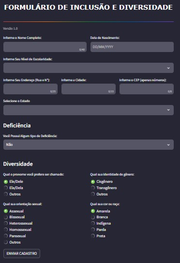
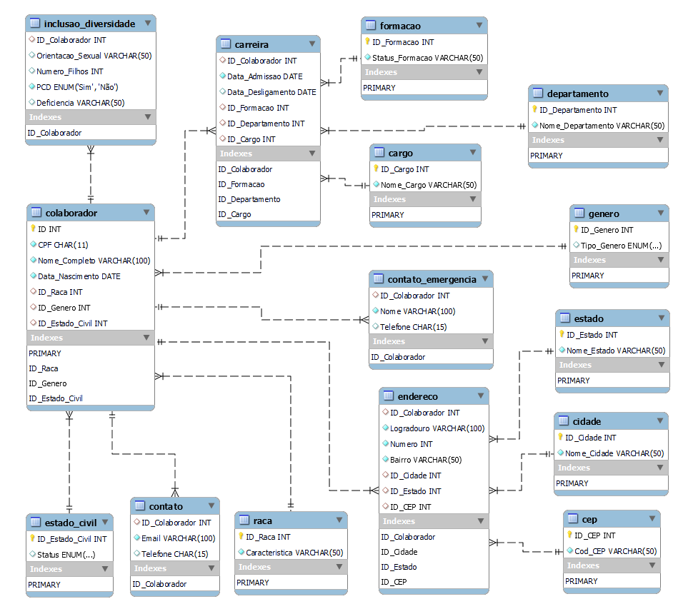

# Nome dos Integrantes

💡 [Eduardo Silva Carvalho](https://www.linkedin.com/in/educarvalh)  
💡 [Isabella Cristina Arving](https://www.linkedin.com/in/isabella-arving-b39385231/)  
💡 [Leonardo Henrique de Brito Junior](https://www.linkedin.com/in/leonardohbrito/)  
💡 [Luiz Antonio C O Junior](https://www.linkedin.com/in/luiz-antonio-15b7b395/)  
💡 [Michael Santana](https://www.linkedin.com/in/michaelsantana95/)  
💡 [Raphael Cleber Vaz](https://www.linkedin.com/in/rcvaz/)  
💡 [Ricardo Mazzeo](https://www.linkedin.com/in/ricardo-mazzeo/)  
💡 [Wiliams Alves](https://www.linkedin.com/in/wiliamsalves/)

# Nome do Projeto

Análise de Melhorias para Diversidade e Inclusão Social na empresa fictícia CORP SOLUTIONS

# Proposta

Desenvolver uma análise visando entender a dinâmica atual da empresa na questão de diversidade e inclusão social de Pessoas com Deficiência (PcD) e oferecer soluções para a empresa trilhe um caminho para se tornar mais diversa e inclusa.
Para a realização das análises foi utilizado uma base de dados disponibilizada pela empresa, os dados remetem as características dos colaboradores no âmbito da empresa, as variáveis disponibilizadas na base para analise são o gênero, idade, raça, educação, endereço, estado, tempo de casa, departamento e senioridade.

## Práticas do desenvolvimento do projeto

- Coleta da base de dados usando python
- Tratamento de encoding e strings com auxilio do python
- Tratamento dos dados aplicado com python
- Exploração dos dados, utilizando gráficos e tabelas em python
- Utilização do Power BI para análise e insights
- Apresentação de problemas e proposta de solução

## Informações do Conjunto de Dados  

O conjunto de dados inclui as seguintes colunas:  

|Variáveis|Descrição|
|---|---|
|`ID`|ID do funcionário|
|`Nome`|Nome do funcionário|
|`Gênero`|Gênero do funcionário|
|`Idade`|Idade do funcionário|
|`Raça`|Raça do funcionário|
|`Formação`|Nível de educação do funcionário|
|`Endereço`|Endereço do funcionário|
|`Estado`|Estado do funcionário|
|`Tempo de Casa`|Tempo de permanência do funcionário na empresa|
|`Departamento`|Departamento onde o funcionário trabalha|
|`Senioridade`|Nível de senioridade do funcionário|

## Limpeza e Preparação dos Dados  

- `Base de dados`: tratamento de encoder.
- `Dados nulos`: foi tomada a decisão de removê-los, uma vez que não há possibilidade de verificação.
- `Valores inconsistentes`: foi identificado inconsistências nas variáveis de idade e tempo de casa, então foram filtradas para comportar ranges de idades coerentes com a realidade.
- Por fim a base foi salva com o tratamento aplicado.

## Exploração dos Dados

Exploramos os dados usando gráficos em Python para entender o comportamento das informações em cada variável.

Os Gráficos aplicados foram:
- Histograma da distribuição de idade;
- Gráfico de pizza mostrando a distribuição de gênero;
- Gráfico de barras mostrando a distribuição de raça, educação, estado, região, departamento, senioridade e tempo de casa.

## Análise dos Dados

- Utilizamos a ferramenta de BI, o Power BI, para realizar as análises e extrações de insights.
- Dos insights de problemas encontrados na organização, a partir das informações da base de dados, podemos abordar quatro pontos críticos:

    - Baixa diversidade de gênero;
    - Baixa diversidade de cor e raça;
    - Idade do quadro de funcionários diminuindo acima dos 35 anos;
    - Ausência de informações sobre colaboradores PcD.

## Dashboard

#### Acesso através do QRcode ou Pelo Link:

[Link Dashboard](https://app.powerbi.com/view?r=eyJrIjoiNzA5Yjg4ZTUtZGEzNi00MDc3LWI5OWMtZjFhZGNiZmVjYjc2IiwidCI6ImMxNDA5NGQwLTA0ZTMtNGM2YS1iMTM0LTg4ZTUxZDMwOWZmYyJ9)

## Propostas de Melhorias

- `Levantamento de Diversidade`: A empresa deverá fazer um levantamento de diversidade de gênero com o atual quadro de colaboradores, a fim de encontrar alguma diversidade já existente.
- `Diversidade de gênero`: 40% de mulheres e 5% outros e garantia de 20% de pessoas transgêneras.
- `Diversidade de Cor e Raça`: 20% de pessoas pretas no quadro geral e 2% de indígenas e amarelos.
- `Inclusão social de PcD's`: 4%  do quadro geral da empresa composto por pessoas com deficiência (PcD).
- `Inclusão social de 50+`: Integração de pessoa com mais de 50 anos.

## Implementações de Melhorias

Para auxiliar nesta tarefa de levantamento de diversidade atual da empresa, a equipe está disponibilizando um exemplo de software a ser empregado, juntamente com uma indicação de schema de banco de dados para armazenamento.

A usabilidade da ferramenta não se limita em apenas atualização do cadastro existente, podendo ser melhorada e adaptada para uso em processos de recrutamento e seleção.

- Formulário de Inclusão e Diversidade

#### Use o QRcode ou Link para Acessar o app.

[Link do Formulário](https://formulario-corp-solutions.streamlit.app/)

- Schema de Melhoria do Banco de Dados

## Conclusões

Acreditamos que, para o desenvolvimento de uma organização que almeja destaque e sucesso, é importantíssimo diversificar e incluir todas as pessoas da sociedade. Assim, são descobertos grandes talentos, verdadeiras joias, que trazem destaque e contribuições significativas para o negócio e para a sociedade.

## Como Usar Este Repósitorio

Atente-se as políticas de `Licenças` do projeto e siga os passos a seguir:

- Clone este repositório para sua máquina local;
- Execute o arquivo Jupyter Notebook `Hackathon_Ada_2024.ipynb` para explorar o conjunto de dados e as visualizações;
- Acesse o arquivo Power BI `dashbord_corp_solution.pbix` para checar o Painel Final e alguns insights iniciais;
- Estude o código do app de formulário, assim como o schema do banco de dados.