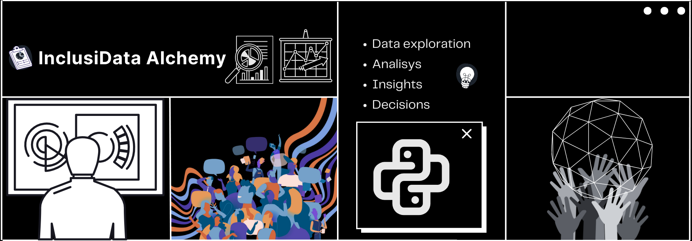

<h1 align="center">Diversidade e Inclusão: Soluções para um Ambiente de Trabalho Equitativo</h1>
<h3 align="center">InclusiData Alchemy</h3>

---

### Projeto idealizado e desenvolvido por:
+ Eduardo Augusto
+ Jhenyffer Oliveira
+ José Truta
+ Lisnane Oliveira
+ Rodrigo Udenal

---

## Proposta 
Diante da necessidade de promover a **diversidade** e a **inclusão** em seu ambiente de trabalho, a Corp Solutions lançou um desafio inovador: um hackathon que convoca equipes de talentos criativos e visionários. Com acesso aos dados e aos recursos necessários, a **InclusiData Alchemy** recebeu a tarefa de desenvolver soluções que atendam essa necessidade. 

Nosso principal objetivo nesse case é identificar oportunidades para ampliar a diversidade na Corp Solutions e contribuir para uma cultura organizacional inclusiva e sustentável, na qual colaboradoras e colaboradores se sintam valorizados.

Assim, abordaremos os principais obstáculos identificados nos dados fornecidos pela empresa, propondo soluções para promover uma mudança cultural que valorize a diversidade e a inclusão em todos os aspectos da organização.

---

## Hipóteses

## Soluções

## Acompanhamentos