[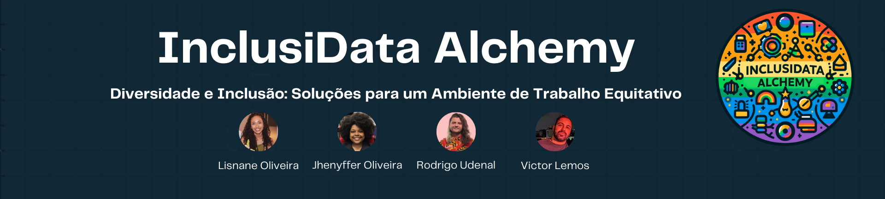](https://github.com/Ada-Empregabilidade/adahack-2024-dados/tree/main/Entregas/DD-08)

<h1 align="center">InclusiData Alchemy</h1>
<h3 align="center">Diversidade e Inclusão: Soluções para um Ambiente de Trabalho Equitativo</h3>

---

### Projeto idealizado e desenvolvido por:
+ Jhenyffer Oliveira
+ Lisnane Oliveira
+ Rodrigo Udenal
+ Victor Lemos

---

# Quem somos?

A **InclusiData Alchemy** se dedica a trazer soluções inovadoras para promover a diversidade e inclusão nas organizações.

Transformamos dados em insights e estratégias.  Utilizando análise de dados, indentificamos lacunas, tendências, oportunidades e orientamos empresas rumo a ambientes mais inclusivos e diversos.

---

# Proposta 

Diante da necessidade de promover a **diversidade** e a **inclusão** em seu ambiente de trabalho, a **Corp Solutions** convida a **InclusiData Alchemy** para desenvolver soluções que atendam essa necessidade.

Assim, abordaremos os principais obstáculos identificados nos dados fornecidos pela empresa e traremos propostas de soluções para a promoção de uma mudança cultural que valorize a diversidade e a inclusão na organização.

--- 

# Organização

Para organização, utilizamos algumas ferramentas:
- Google Drive, para concentração da documentação, imagens, entre outros;
- Documentos Google, para estruturar as etapas de um plano de ação, levantamento de hipóteses, comprovação ou negação das hipóteses, insights, pesquisas de referências externas e o direcionamento da proposta;
- Monday, para dividir tarefas, estabelecer prazos, ajustar notas e comentários sobre as atividades.

#### Entre essas ferramentas, vale destacar o Roteiro criado no Documentos Google, disponível [aqui](https://docs.google.com/document/d/1FiSdodF9yHHHeaZOQbZjmg-30HWEZoJMiIvCgcnEMPA/edit?usp=sharing), e o Monday, disponível abaixo.

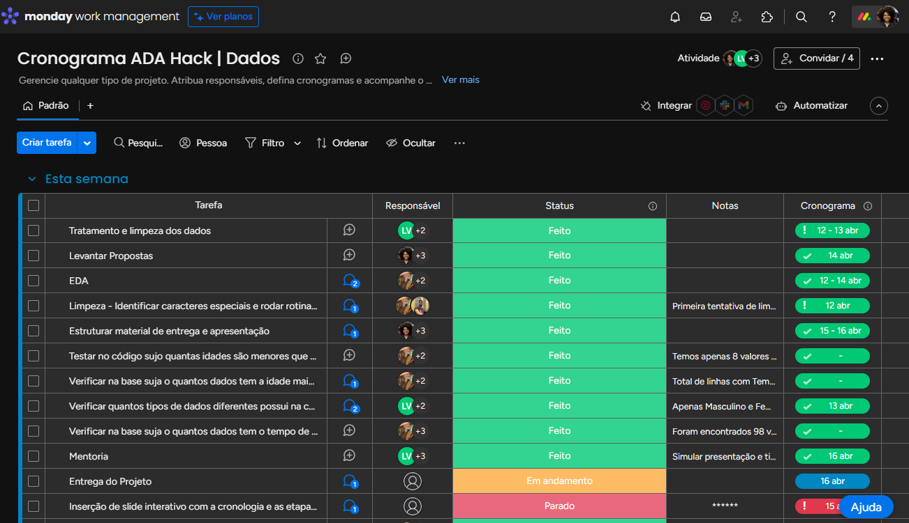
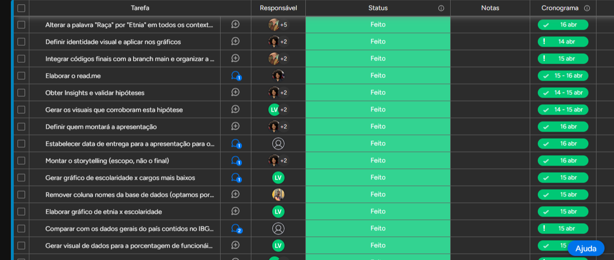
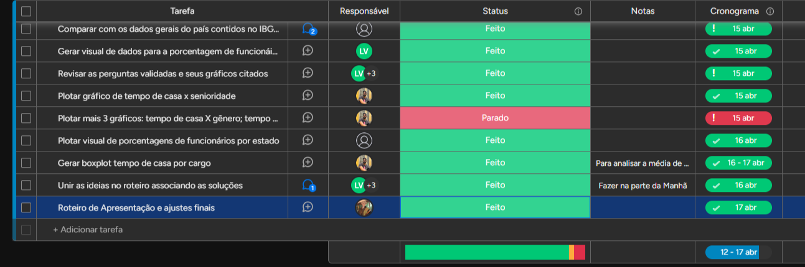

---

# Análise Profunda

Investimos tempo e esforço para observar minuciosamente os dados fornecidos pela Corp Solutions e levantar hipóteses. Essa fase foi crucial para compreender a situação atual e estabelecer uma base sólida para a tomada de decisão.

---

# Hipóteses

Com algumas visualizações e após muita pesquisa, elaboramos 3 hipóteses que podem evidenciar prováveis razões pelas quais diversidade e inclusão ainda são um desafio para a Corp Solutions.

## 1. Qual é a qualidade e a diversidade dos dados? 

Ao tratar os dados, observamos pouca qualidade e baixa diversidade nos dados recebidos. 

Os principais indicadores de diversidade dividem-se em 4 pilares: gênero, etnia, escolaridade e idade. Cada um desses indicadores, contém problemáticas, descritas abaixo.

## • Gênero:

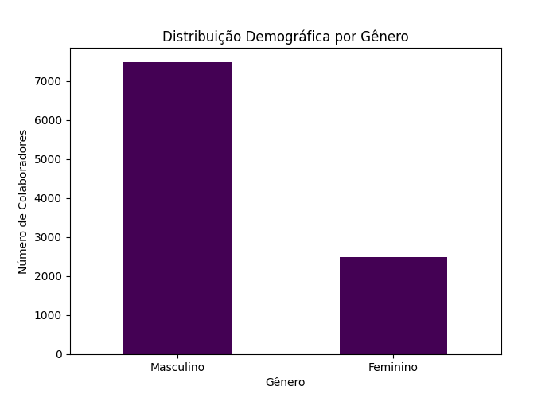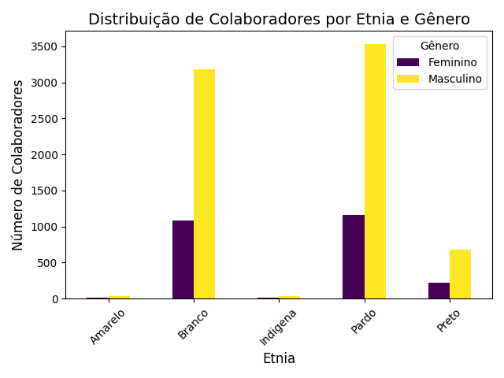
> Baixa quantidade de mulheres diversas na empresa.

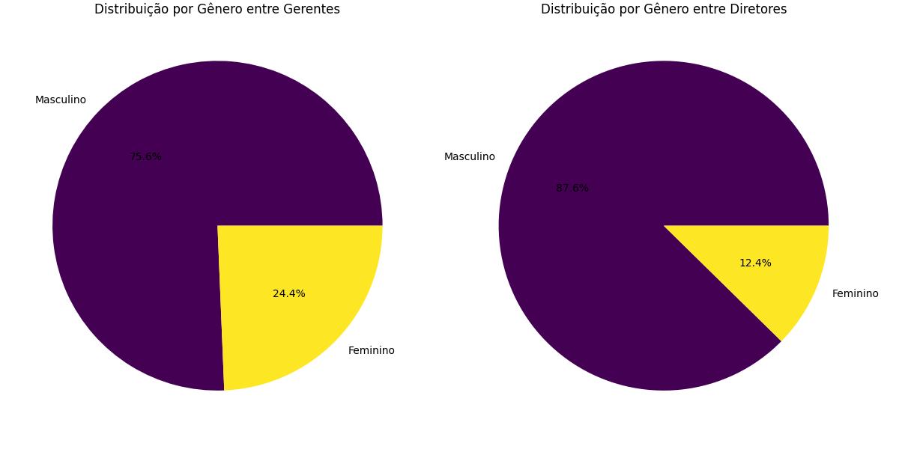
> Baixa representação de mulheres nos cargos de liderança.

## • Etnia:

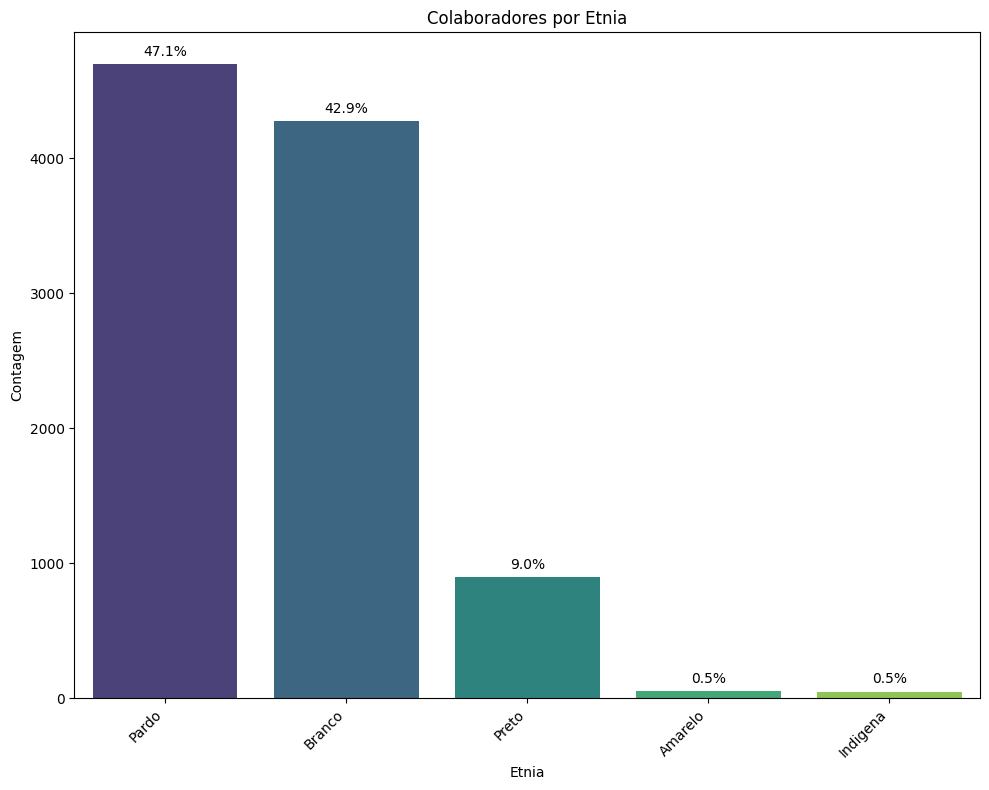
> Pouca contratação de grupos étnicos minoritários (pessoas pretas, indígenas e amarelas).

> Observamos que de acordo com o censo do IBGE de 2022  a população do Brasil é composta por 43,72% de pessoas brancas, 10,23% pretas, 45,62% pardas, 0,42% amarelas e 0,61% indígenas.

.png).png)
> Baixa concentração de grupos étnicos minoritários em cargos de liderança

## • Escolaridade:
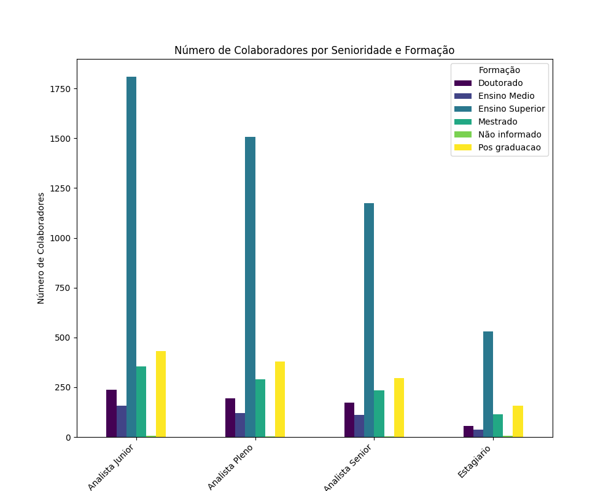
> Graduação é um pré-requisito comum de contratação.

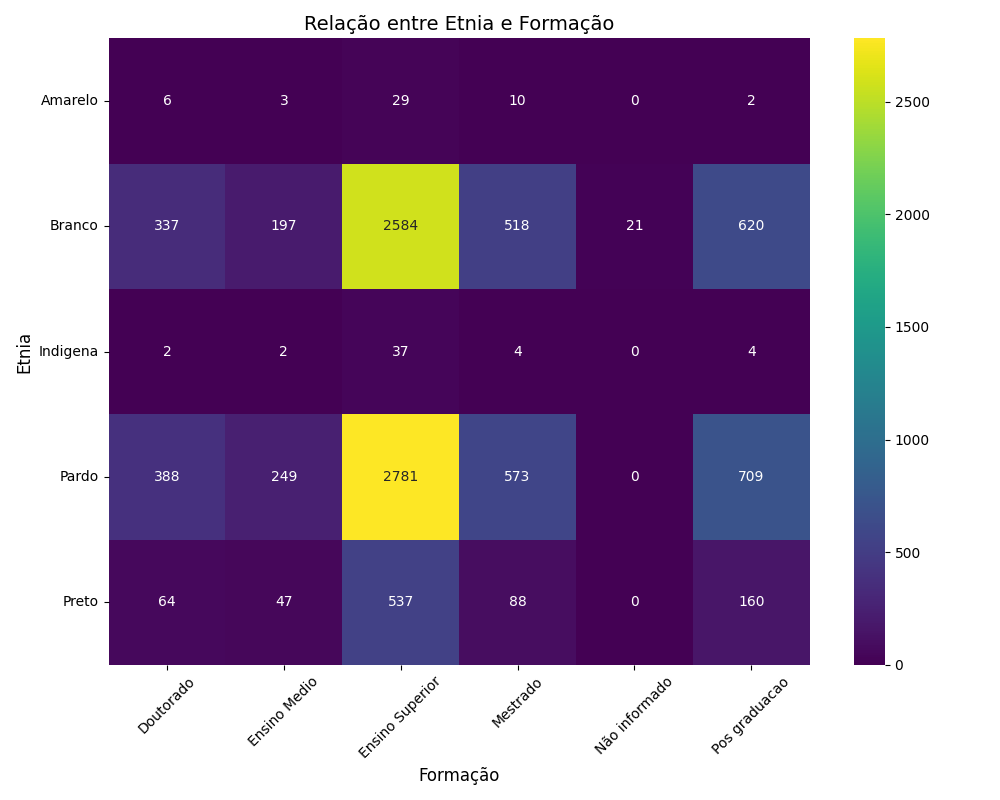
> A maioria dos funcionários com perfil étnico-racial minoritário possuem formação superior.

## • Idade:

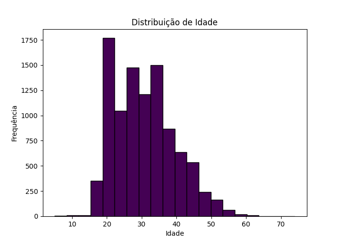
> As contratações se concentram em pessoas mais jovens.

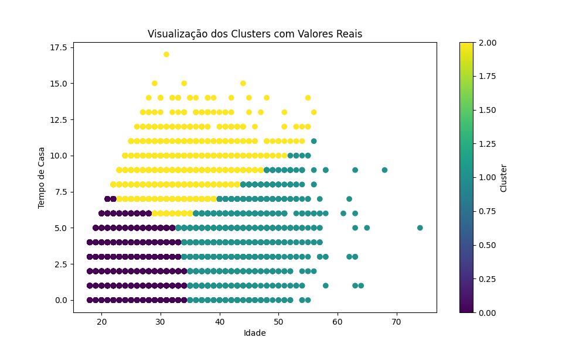
> A taxa de retenção é baixa, por volta de 5 anos.

---

# Validação das Hipóteses 

Com base nessas visualizações, conclui-se que há pouca contratação de grupos étnicos minoritários (mulheres, pessoas pretas, indígenas e amarelas).

No entanto, para as categorias branco e pardo, nota-se conformidade com a autodeclaração da população brasileira. É importante pontuar que, de acordo com o censo do IBGE de 2022, a população do Brasil possui 43,72% de pessoas autodeclaradas brancas e 45,62% autodeclaradas pardas.

Além disso, vale ressaltar que há 10,23% autodeclaradas pretas, 0,42% amarelas e 0,61% indígenas.  

Nesse momento, encontra-se a necessidade da inclusão de mais perfis de grupos subrepresentados, como mulheres, LGBTQIAPN+, gêneros além da cisgeneridade binária, PCD's, etc.

---

## 2. Como os indicadores de diversidade aparecem na coleta de dados?

Atualmente, a empresa trabalha com poucos dados de diversidade, apenas etnia e gênero, sendo o último apenas binário, sem abranger os demais.

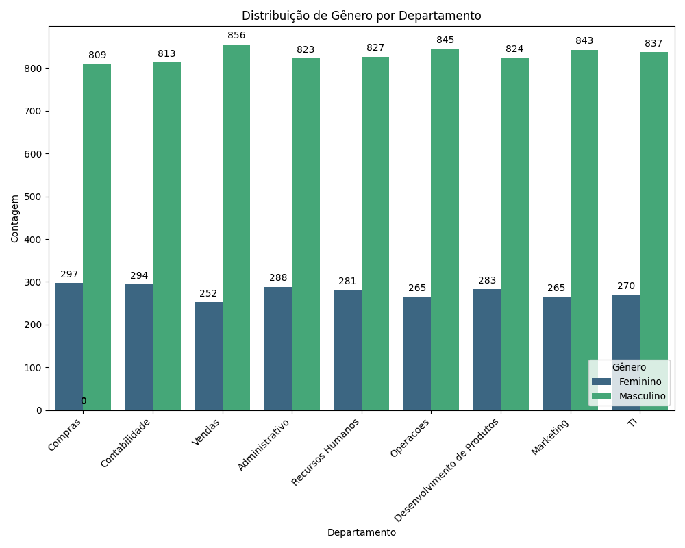
> Distribuição de gênero por departamento demonstra pouca presença feminina.

Em relação ao cuidado com os dados sensíveis (ex.: nome, idade, cargo), ficou evidente que a empresa não possui uma solução. Para trabalharmos os dados com segurança, incluímos uma coluna de ID hexadecimais de quatro dígitos e removemos a coluna de nomes e endereços.

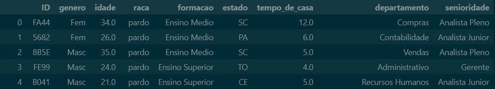
> Tabela contendo ID no lugar do nome.

---

## 3. Como está a presença de diferentes grupos demográficos em cargos de liderança?

De acordo com os gráficos apresentados na questão 1, é possível observar que apenas 12,4% das mulheres ocupam cargos de diretoria e 24,4% ocupam cargos de gerência.

Em relação a etnia, as pessoas pretas, amarelas e indígenas ocupam menos de 6% dos cargos de diretoria e 9% dos cargos de gerência.

De acordo com as análises realizadas, há disparidades significativas na reoresentação de grupos minoritários em comparação com os grupos majoritários. As mulheres, por exemplo, ocupam cerca de 20% do quadro de colaboradores da empresa. Já a proporção de colaboradores pretos, indígenas e amarelos é 10%.

---

# Propostas de Soluções

Por fim, com base nas informações que reunimos durante as etapas anteriores e dados colhidos externamente, como os do IBGE, desenvolvemos 4 propostas de solução. 

Essas soluções foram projetadas especificamente para abordar os desafios de diversidade e inclusão identificados na empresa, fornecendo assim um caminho claro e acionável para promover a equidade e a inclusão.

# Questão 1

> Como proposta de solução, para resolver as problemáticas levantadas na primeira pergunta, sugerimos a implementação de 3 ações conjuntas:

## • Clube de Benefícios 
Implementação de um programa de mentoria reversa, na qual funcionários de grupos minoritários são emparelhados com funcionários de grupos majoritários para troca de experiências e aprendizado mútuo. 

## • Criação de grupos de afinidade:
Criação de espaços para que os colaboradores compartilhem experiências e perspectivas únicas associadas ao desafio da diversidade no ambiente de trabalho. Promover o desenvolvimento de habilidades de liderança, empatia, comunicação e trabalho em equipe 

## • Promoção de Palestras
Investimento em palestras e outras formas de educação nas empresas acerca de gênero, sexualidade etc.

> Com essas ações, os benefícios esperados são:

+ Fomento da compreensão e empatia entre funcionários de diferentes origens.
+ Desenvolvimento de uma liderança diversificada e inclusiva.
+ Aumento da retenção de talentos diversificados.
+ Estímulo à inovação e criatividade dentro da empresa.

# Questão 2

> Como proposta de solução, para resolver as problemáticas levantadas na segunda pergunta, sugerimos a implementação de 3 ações conjuntas:

## • Coleta de Dados Aprimorada
Implementar formulários mais abrangentes para coleta de dados demográficos, incluindo sexualidade, identidades de gênero não-binárias e deficiências. 

A InclusiData Alchemy fez uma proposta de [formulário](https://forms.gle/TmiCJoefwcU6oXEG8) visando mapear mais características de diversidade.

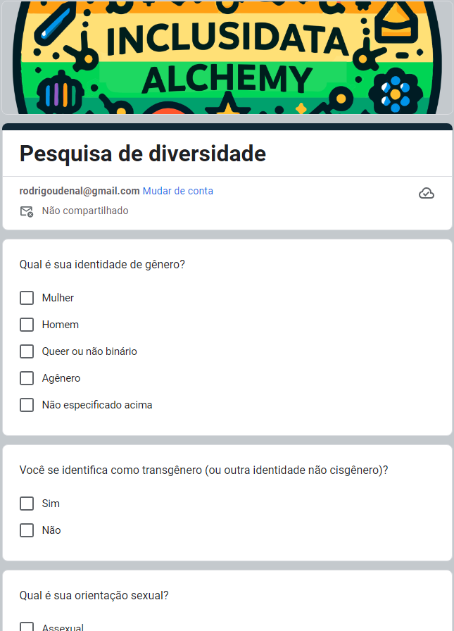
> Exemplo de formulário com perguntas aprimoradas.

## • Melhoria na Visualização de Dados
Aprimorar a plotagem de gráficos para uma visualização mais detalhada e abrangente dos dados de diversidade.

## • Análise de Tendências e Avaliação de Impacto
Realizar análises mais profundas sobre as tendências ao longo do tempo e avaliar o impacto das medidas de diversidade e inclusão implementadas.

## • Integração com Processos de Tomada de Decisão
Garantir que os dados de diversidade coletados sejam considerados integralmente nos processos de recrutamento e tomada de decisão da empresa.

## • Garantia da Privacidade dos Dados
Utilizar no uma coluna de ID único para identificação ao invés de uma coluna com o nome dos colaboradores no armazenamento dos dados de diversidade.

> Com essas ações, os benefícios esperados são:

+ Coleta de dados mais abrangente e representativa.
+ Melhoria na compreensão dos padrões de diversidade.
+ Melhor embasamento para tomadas de decisão relacionadas à diversidade e inclusão.
+ Promoção de uma cultura mais inclusiva e equitativa.

# Questão 3

> Como proposta de solução, para resolver as problemáticas levantadas na terceira pergunta, sugerimos a implementação de 3 ações conjuntas:

## • Formação Continuada Específica
Desenvolver programas de formação continuada direcionados a grupos minoritários para promover o acesso à educação e desenvolvimento profissional.

## • Progressão de Carreira Equitativa
Implementar políticas e programas que garantam oportunidades equitativas de progressão de carreira para todos os funcionários, independentemente de sua origem étnica.

## • Monitoramento e Avaliação
Realizar monitoramento regular do progresso dos programas de formação e progressão de carreira para garantir sua eficácia e fazer ajustes conforme necessário.

# Proposta de Solução Extra 

## • Aquisição de Novos Talentos Através de Stands em Eventos de Tecnologia 2024/2025

Anualmente os 30 principais eventos de tecnologia que ocorrem no Brasil recebem cerca de 500 mil participantes o que torna viável a aquisição de parte desses talentos.

Esta ação também aumento o alcance da marca Corp Solutions dentro do ecossistema de empresas brasileiras.

Este levantamento foi realizado dentro de eventos com público plural ou com iniciativas de diversidade e inclusão para o público o que está alinhado com os objetivos de aumento na diversidade. 

> Com essa ação, os benefícios esperados são:
+ Maior acesso à educação e desenvolvimento profissional para grupos minoritários.
+ Redução das disparidades na progressão de carreira.
+ Promoção da equidade e inclusão dentro da empresa.
+ Contribuição para um ambiente de trabalho mais diversificado e inovador.

---

# Ferramentas utilizadas

| Python | Pandas | Matplotlib | Seaborn | Folium | Git | Monday |
| ------ | ------ | ---------- | ------- | ------ | --- | ------ |
|  |  |  |  |  |  |  |
